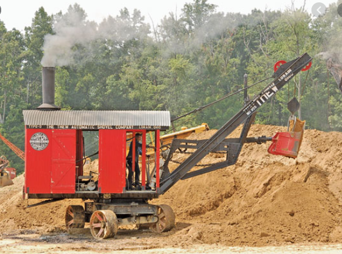

```{css, echo=FALSE, message = FALSE}
.author,.title,.date,.output{
    display: none;
}

p.stylePmd{
  
  text-align: center;
  font-size: 22px;
  color: navy;
  font-family: verdana;
  font-weight: bold;
}

div.styledmd{
  text-align: center;
}


```
<br>
<div class="styledmd">
<br>
<a href="http://www.census.gov/programs-surveys/acs/data/pums.html">United Stated Census Bureau</a></p> <a href="https://github.com/aiden-dickson/DACSS-601">Project Repository on Github</a><br><br><br>
<h2>Under Construction!  Appreciate Your Patience</h2>
</div>


<p class="stylePmd">Setting up Libraries</p>
```{r echo = FALSE, message = FALSE} 

library(tidyverse)
library(haven)
library(dplyr)
library(knitr)
library(tinytex)
library(ggplot2)
library(GGally)
library(vtable)
library(shiny)
library(knitr)
library(googlesheets4) 
library(rmarkdown)
knitr::opts_chunk$set(echo = FALSE)

```


<p class="stylePmd">Input of Data and Changing Columns</p>
```{r echo = FALSE, message = FALSE}
all_ages <- read.csv("data/all-ages.csv")
all_ages <- rename(all_ages, "Employed_Full_Time_Year_Round" = "Employed_full_time_year_round", 
                   "Unemployment_Rate" = "Unemployment_rate", "Percentile_25th" = "P25th", "Percentile_75th" = "P75th")

```


<p class="stylePmd">Input of Data and Changing Columns</p>
```{r echo = FALSE, message = FALSE}

head(all_ages, 5)

```


